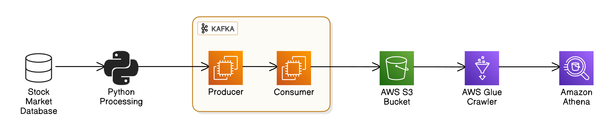

# Stock Market Data Pipeline with Kafka, S3, Glue, and Athena



This project demonstrates a stock market data pipeline using Apache Kafka, AWS S3, AWS Glue, and Amazon Athena. The pipeline allows for streaming stock market data from a CSV file, which is sent to a Kafka cluster hosted on an EC2 instance. The Kafka consumers then push the data to an S3 bucket. The data is cataloged using AWS Glue and queried with Amazon Athena.

## Prerequisites

Before you begin, ensure you have the following tools and services:

1. **Amazon EC2** instance running (preferably Amazon Linux 2)
2. **Java 8** (Amazon Corretto) installed on your EC2 instance
3. **Kafka 3.9.0** installed on your EC2 instance
4. **Python 3.x** with necessary libraries for Kafka producer
5. **AWS CLI** configured with appropriate credentials to interact with S3, Glue, and Athena

## Setup Instructions

### Step 1: Download and Install Kafka

1. Download Kafka 3.9.0:
   ```bash
   wget https://downloads.apache.org/kafka/3.9.0/kafka_2.12-3.9.0.tgz
   ```

2. Extract the downloaded file:
   ```bash
   tar -xvf kafka_2.12-3.9.0.tgz
   ```

### Step 2: Install Java 8 (Amazon Corretto)

Apache Kafka requires Java to run. Install Java 8 using the following command:
```bash
sudo yum install -y https://corretto.aws/downloads/latest/amazon-corretto-8-x64-linux-jdk.rpm
```

### Step 3: Start Zookeeper

Kafka depends on Zookeeper to manage broker metadata. Start Zookeeper with the following command:
```bash
bin/zookeeper-server-start.sh config/zookeeper.properties
```

### Step 4: Configure Kafka Server

You need to configure the Kafka server to use your EC2 instance's public IP address.

1. Open the `server.properties` configuration file:
   ```bash
   sudo nano config/server.properties
   ```

2. Modify the `advertised.listeners` line to point to your EC2 instance's public IP:
   ```properties
   advertised.listeners=PLAINTEXT://<your_public_ip>:9092
   listeners=PLAINTEXT://0.0.0.0:9092
   ```

### Step 5: Create a Kafka Topic

Create a Kafka topic for the stock market data. You can use the following command:
```bash
bin/kafka-topics.sh --create --topic test_topic --bootstrap-server <your_public_ip>:9092 --replication-factor 1 --partitions 1
```

### Step 6: Start Kafka Producer

Start the Kafka producer, which will send stock market data to the `test_topic`:
```bash
bin/kafka-console-producer.sh --topic test_topic --bootstrap-server <your_public_ip>:9092
```

### Step 7: Start Kafka Consumer

Start the Kafka consumer, which will read from the `test_topic` and send the data to an S3 bucket:
```bash
bin/kafka-console-consumer.sh --topic test_topic --bootstrap-server <your_public_ip>:9092
```

### Step 8: Data Transfer to S3 and Glue

Once Kafka is up and running, a Python script can be used to send the stock market data (from a CSV file) to the Kafka producer. The consumer will pick up the data and upload it to an S3 bucket. 

Then, set up an AWS Glue crawler to catalog the data stored in the S3 bucket.

1. Create an S3 bucket to store the data.
2. Set up an AWS Glue crawler to scan the data in the S3 bucket and create a Glue table.
3. Use Amazon Athena to query the cataloged data.

## Python Producer Script

You will need to implement a Python producer script to read the CSV file and send the data to the Kafka producer. Example Python code:

```python
from kafka import KafkaProducer
import pandas as pd

# Read CSV file
data = pd.read_csv('stock_market_data.csv')

# Set up the Kafka producer
producer = KafkaProducer(bootstrap_servers='<your_public_ip>:9092')

# Send each row of the CSV file to the Kafka topic
for index, row in data.iterrows():
    message = row.to_json().encode('utf-8')
    producer.send('test_topic', value=message)

producer.flush()
```

## AWS Glue Setup

1. Create a Glue crawler to scan your S3 bucket where the Kafka consumer is uploading data.
2. Create a Glue table to catalog the data.
3. Use Amazon Athena to query the cataloged data from the Glue table.

### Example Athena Query:
```sql
SELECT * FROM stock_market_data WHERE stock_symbol = 'AAPL';
```

## Notes

- Ensure that your EC2 instance has the appropriate security group settings to allow inbound traffic on port `9092` for Kafka.
- Replace `<your_public_ip>` with the actual public IP address of your EC2 instance.
- The Kafka producer and consumer use the topic `test_topic`—you can change this to suit your needs.
- Make sure AWS permissions for S3, Glue, and Athena are configured correctly for your user/role.
